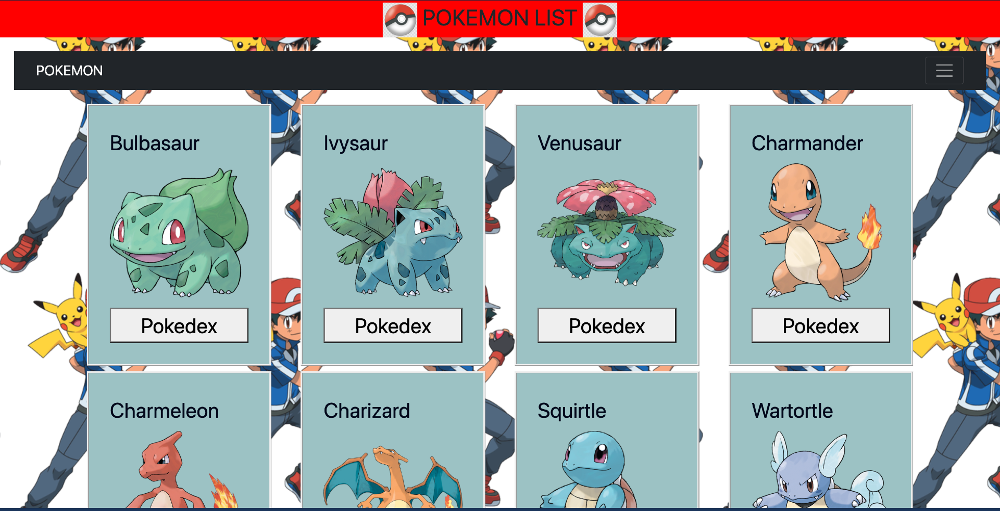
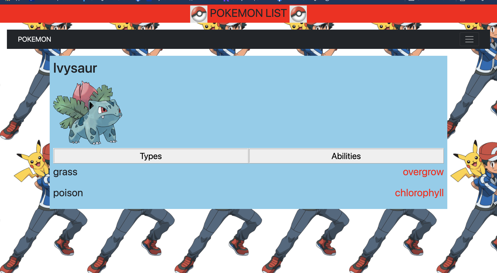
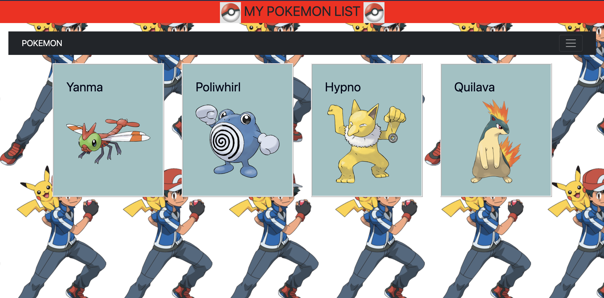
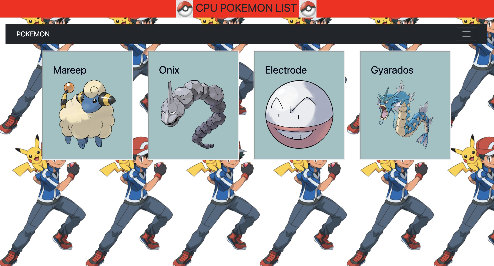

# Link to website
https://abinmuds.github.io/Pokemon/

# Description
This App is generally for pokemon fans, who likes to scroll through the pokemons in list in homepage and if they want to get additional details, they can click pokedex to do so. And also we have links to Mypokemon list and Cpu pokemon list, generally for the future to build a gaming project.
I built this project using fetch to get datas from API and used a lot of DOM manupulation.
API used: https://pokeapi.co/

# App Screenshot

# Technologies used
    HTML, CSS,JavaScript,Bootstrap,API

# User stories:

* As a user I can use this service to view information regarding Pokemons.
* As a user I can go to the MyPokemon list page and can randomly have the pokemon they want and also can choose their opponent as the CPU also generates random pokemon.
* As a user I am able to go to the pokedex and get some additional details such as Types and Abilities.

# Major hurdles
The things that gave me more trouble was when I clicked Pokedex of the pokemon, I had to remove all the element and create a new format using DOM manipulation in the javaScript file, and also styling was quite difficult in there. I found some solution to overcome the CSS problem using id or class in the elements though it was time-consuming.

# Future features
* Built a platform for the battle between pokemons and users can choose their pokemons

